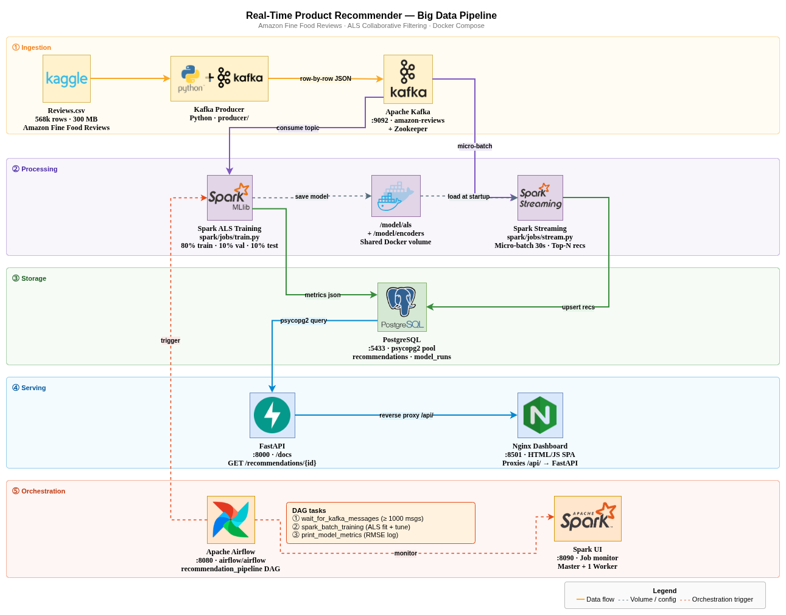

# Real-Time Product Recommender — Big Data Pipeline

> Projet du module Big Data · Amazon Fine Food Reviews (~500 k avis) · ALS Collaborative Filtering

---

## Architecture



---

## Quick Start

### Prerequisites
- Docker + Docker Compose v2
- ≥ 6 GB RAM available (Spark needs 2 GB for the worker)
- `dataset/Reviews.csv` present (download from Kaggle: *amazon-fine-food-reviews*)

### 1 — Launch the full stack

```bash
docker compose up --build
```

All 8 services start: Zookeeper, Kafka, Spark master+worker+stream, PostgreSQL, Airflow, producer, FastAPI, Dashboard.

### 2 — Trigger the training DAG

Open Airflow at **http://localhost:8080** (login: `airflow` / `airflow`), then trigger the `recommendation_pipeline` DAG manually — **or** run:

```bash
docker compose exec airflow airflow dags trigger recommendation_pipeline
```

The DAG runs three steps:
1. `wait_for_kafka_messages` — waits until ≥ 1 000 messages are in the topic
2. `spark_batch_training` — trains ALS on 80% of data, tunes on 10%, saves model
3. `print_model_metrics` — logs RMSE to Airflow

### 3 — Open the interfaces

| Service | URL | Credentials |
|---------|-----|-------------|
| **Dashboard** | http://localhost:8501 | — |
| **Airflow** | http://localhost:8080 | `airflow` / `airflow` |
| **FastAPI docs** | http://localhost:8000/docs | — |
| **Spark UI** | http://localhost:8090 | — |

---

## Pipeline Components

| Component | Description |
|-----------|-------------|
| `producer/` | Streams `Reviews.csv` row-by-row to Kafka as JSON `{UserId, ProductId, Score, Time}`. Configurable rate (DELAY_MS) and subset (MAX_ROWS). |
| `spark/jobs/train.py` | Cleans data (drops inactive users/products), encodes string IDs → integers, runs ALS with hyperparameter grid (rank × regParam), evaluates on val + test sets, saves model + metrics. |
| `spark/jobs/stream.py` | Loads trained model once at startup, consumes Kafka micro-batches every 30 s, generates Top-N recommendations per user, writes to PostgreSQL. |
| `airflow/dags/` | `recommendation_pipeline` DAG — Kafka sensor → batch training → metrics report. |
| `api/` | FastAPI with psycopg2 connection pool. Endpoints: `/recommendations/user/{id}`, `/metrics`, `/stats`, `/pipeline-status`, `/users`, `/health`. |
| `dashboard/` | Nginx serving a single-page HTML/JS dashboard. Nginx reverse-proxies `/api/` → FastAPI. No Python runtime needed. |
| `postgres/` | `recommendations` table (UNIQUE on user+product for upsert safety) + `model_runs` history table. |

---

## Data Splits

| Split | Proportion | Purpose |
|-------|-----------|---------|
| Training | **80%** | ALS matrix factorization fit |
| Validation | **10%** | Hyperparameter grid search (rank ∈ \{10,20\}, regParam ∈ \{0.01,0.1\}) |
| Test (held-out) | **10%** | Final RMSE evaluation — model never sees this data during training |

Model metric: **RMSE** (`pyspark.ml.evaluation.RegressionEvaluator`).  
Expected range: **0.8 – 1.3** for ALS on Amazon reviews (sparse collaborative filtering).

---

## API Contract

```bash
# Get Top-N recommendations for a user
GET /recommendations/user/{user_id}?n=10
→ {"user_id": "A3SGXH7AUHU8GW", "recommendations": ["B001E4KFG0", ...], "predicted_ratings": [4.231, ...]}

# Model metrics (RMSE, best params, training timestamps)
GET /metrics
→ {"val_rmse": 0.9123, "test_rmse": 0.9341, "best_params": {...}, "trained_at": "...", "train_rows": 450000}

# Pipeline / training status
GET /pipeline-status
→ {"model_ready": true, "val_rmse": 0.9123, "unique_users": 28341, "unique_products": 8761, ...}

# Aggregate stats
GET /stats
→ {"users_with_recommendations": 12500, "total_recommendation_rows": 125000}
```

---

## Environment Variables

| Variable | Default | Description |
|----------|---------|-------------|
| `DELAY_MS` | `10` | Milliseconds between Kafka messages in the producer |
| `MAX_ROWS` | `50000` | Max CSV rows to stream (0 = full ~568 k dataset) |
| `TOP_N` | `10` | Recommendations per user generated by streaming job |
| `MIN_USER_RATINGS` | `5` | Min reviews for a user to be included in training |
| `MIN_PRODUCT_RATINGS` | `5` | Min reviews for a product to be included in training |

Edit `.env` before running to tune performance and dataset size.

---

## Running Spark Jobs Directly (bypass Airflow)

```bash
# Batch training
docker compose exec airflow spark-submit \
  --master local[*] \
  --packages org.apache.spark:spark-sql-kafka-0-10_2.12:3.5.0,org.postgresql:postgresql:42.7.3 \
  /jobs/train.py

# Streaming (long-running — runs as spark-stream service automatically)
docker compose exec spark-master spark-submit \
  --master local[2] \
  --packages org.apache.spark:spark-sql-kafka-0-10_2.12:3.5.0,org.postgresql:postgresql:42.7.3 \
  /jobs/stream.py
```

---

## Teardown

```bash
# Stop and remove containers + volumes
docker compose down -v

# Rebuild a single service
docker compose up --build api
docker compose up --build dashboard
```

---

## Troubleshooting

| Problem | Solution |
|---------|----------|
| Airflow DAG stuck at `wait_for_kafka_messages` | Check producer logs: `docker compose logs producer`. Ensure `MAX_ROWS > 1000`. |
| `spark_batch_training` OOM | Increase Docker memory limit to ≥ 6 GB. Reduce `spark.sql.shuffle.partitions`. |
| Dashboard shows "API offline" | Wait for all services to be healthy; check `docker compose logs api`. |
| Spark streaming not generating recs | Ensure training completed and `/model/metrics.json` exists: `docker compose exec spark-stream ls /model/`. |
| Duplicate recommendations after rerun | Handled by `UNIQUE(user_id, product_id)` constraint in PostgreSQL (append inserts may duplicate if constraint not yet applied — run `docker compose down -v` first). |
